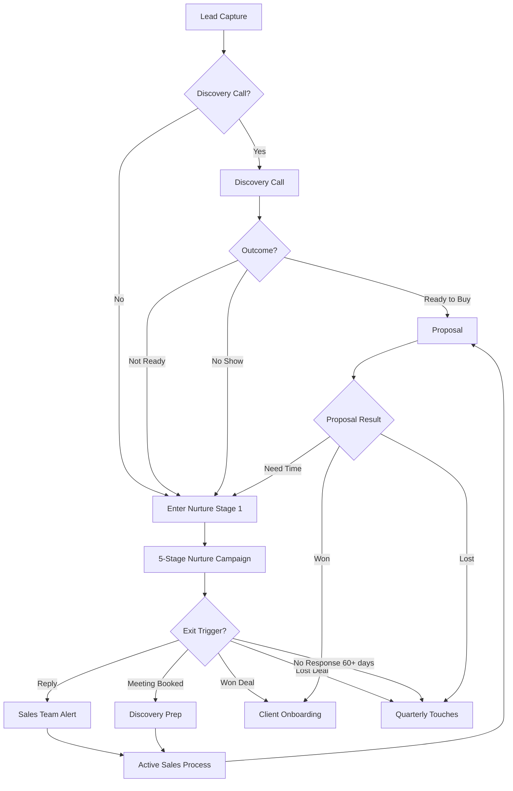
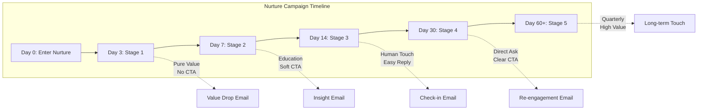
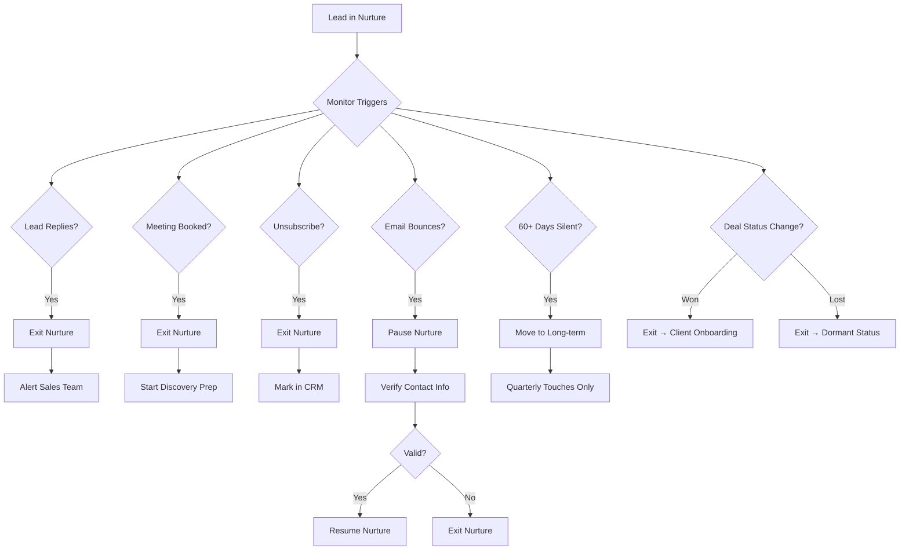
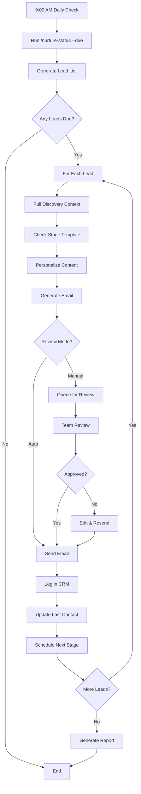
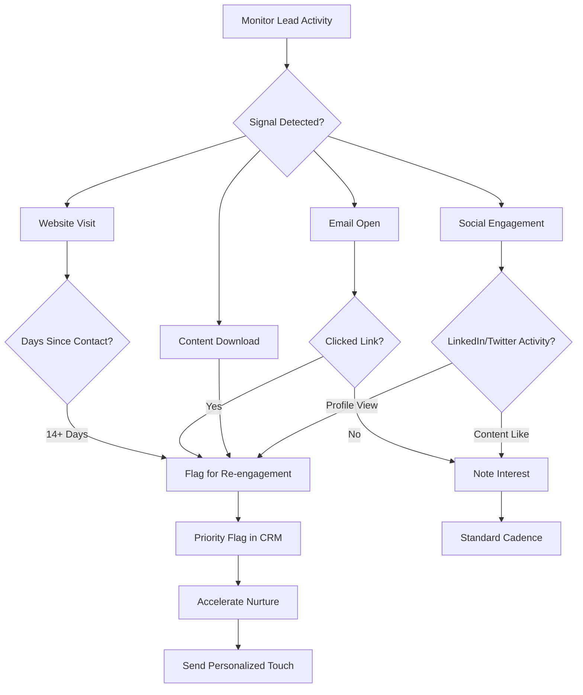
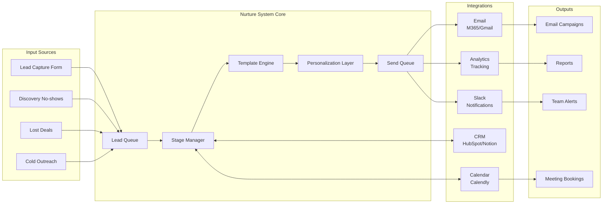
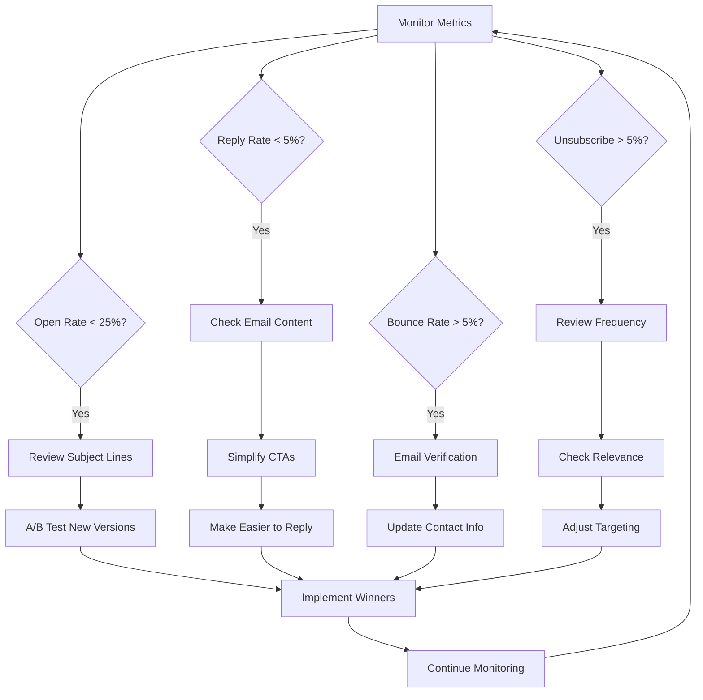
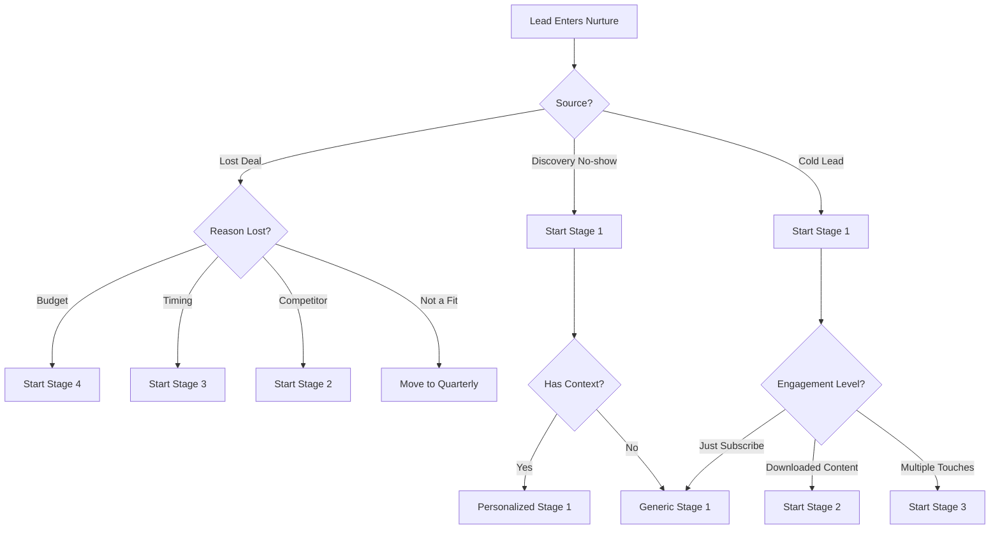
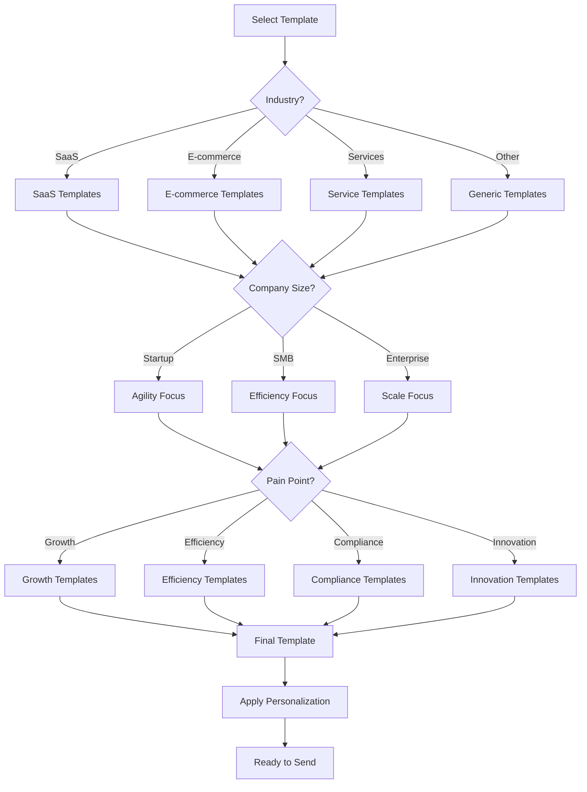

# Nurture Sequence Workflow Diagrams

## Overall Lead Flow

## 5-Stage Nurture Sequence Detail

## Exit Condition Flow

## Daily Batch Processing Workflow

## Re-engagement Signal Detection

## Integration Architecture

## Performance Optimization Flow

## Decision Tree for Stage Selection

## Email Template Selection Logic

---

## How to Use These Diagrams

1. **Overall Lead Flow**: Reference this when explaining the nurture system to team members or planning lead routing.

2. **5-Stage Detail**: Use this to understand the timing and purpose of each nurture stage.

3. **Exit Conditions**: Consult when setting up automation rules or training team on lead handling.

4. **Batch Processing**: Follow this workflow for daily nurture operations.

5. **Re-engagement Signals**: Use to identify when leads show renewed interest.

6. **Integration Architecture**: Reference when setting up or troubleshooting integrations.

7. **Performance Optimization**: Follow this flow when metrics drop below targets.

8. **Stage Selection**: Use this decision tree when manually placing leads into nurture.

9. **Template Selection**: Follow this logic for choosing the most relevant email templates.

---

*Note: These diagrams are rendered using Mermaid markdown. They can be viewed in any markdown viewer that supports Mermaid, including GitHub, GitLab, and many documentation tools.*