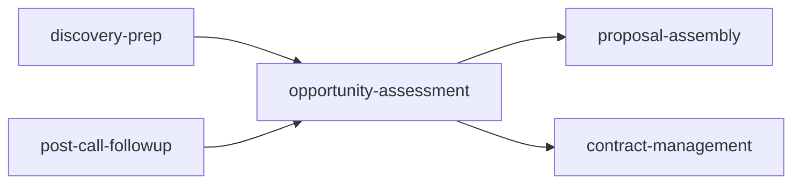

# Command: opportunity-assessment

## Purpose
Transform discovery meeting transcripts into structured business process maps and opportunity matrices with strict anti-hallucination rules.

## Usage
```bash
/opportunity-assessment [client-name] [options]
```

## Options
- `--source`: transcript|notes|fireflies-url|manual (default: auto-detect)
- `--output`: json|markdown|notion (default: markdown)
- `--depth`: quick|standard|comprehensive (default: standard)
- `--validate`: true|false (default: true)

## Examples

### Basic Assessment
```bash
/opportunity-assessment acme-corp
```
Processes ACME Corp discovery transcript with standard depth

### With Fireflies URL
```bash
/opportunity-assessment acme-corp --source https://fireflies.ai/meeting/abc123
```
Pulls specific Fireflies transcript

### Quick Assessment
```bash
/opportunity-assessment client --depth quick
```
20-minute fast assessment focusing on top opportunities

### Direct to Notion
```bash
/opportunity-assessment client --output notion
```
Saves outputs directly to Notion client workspace

## Outputs

1. **audit.json** - Structured assessment data
2. **opportunity-matrix.md** - Prioritized opportunities (Quick Wins → Strategic → Later)
3. **process-map.md** - Current-state business processes
4. **discovery-unknowns.md** - Follow-up questions for missing data

## Anti-Hallucination Rules

**CRITICAL**: This command enforces strict data integrity:
- Never fabricates numbers (dollars, hours, percentages)
- Never extrapolates metrics from qualitative statements
- Uses NULL or UNKNOWN for missing data
- All pain points must be direct quotes
- Quality gate: "Can I point to where client said this?"

## Integration

### Input Sources
- Fireflies transcripts (via MCP)
- Notion meeting notes (via MCP)
- Local files in active-projects/[client]/meetings/
- Manual transcript input

### Output Destinations
- Notion client workspace (via MCP)
- Local markdown files
- Slack notification (via MCP)

### Workflow Integration


## 5-Phase Workflow (42 minutes)

1. **Initialize** (2 min) - Load transcript, create structure
2. **Extract Facts** (10 min) - Parse explicit statements only
3. **Map Processes** (15 min) - Document workflows as stated
4. **Identify Opportunities** (10 min) - Find automation potential
5. **Generate Outputs** (5 min) - Create deliverables

## Quality Standards

### Success Criteria
- ✅ All stated facts captured
- ✅ 2-4 processes mapped
- ✅ 5-10 opportunities identified
- ✅ Unknowns documented
- ✅ NO fabricated metrics

### Rejection Triggers
- ❌ Made-up numbers
- ❌ ROI without data
- ❌ Invented process steps
- ❌ Generic pain points

## Common Use Cases

### After Discovery Call
```bash
/opportunity-assessment new-client
# Automatically finds and processes recent transcript
```

### Preparing Proposal
```bash
/opportunity-assessment client --depth comprehensive
# Deep analysis for detailed proposal
```

### Quick Win Identification
```bash
/opportunity-assessment client --depth quick
# Fast scan for immediate opportunities
```

## Troubleshooting

**"No transcript found"**
- Check Fireflies connection
- Try `--source manual` for paste
- Verify client name spelling

**"Insufficient data"**
- Transcript too short (<500 words)
- Schedule deeper discovery
- Review discovery-unknowns.md

**"Validation failed"**
- Fabricated metrics detected
- Review and mark as UNKNOWN
- Check anti-hallucination rules

## Related Commands
- `/prep-call` - Prepare for discovery meeting
- `/draft-followup` - Process initial transcript
- `/send-proposal` - Generate proposal from opportunities

## Support
For issues, check:
1. Transcript quality (30+ minutes)
2. Connector configuration
3. Anti-hallucination compliance
4. discovery-unknowns.md output

**Remember**: When in doubt, mark it UNKNOWN!