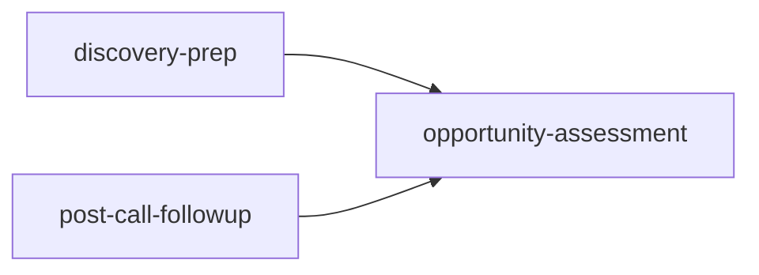
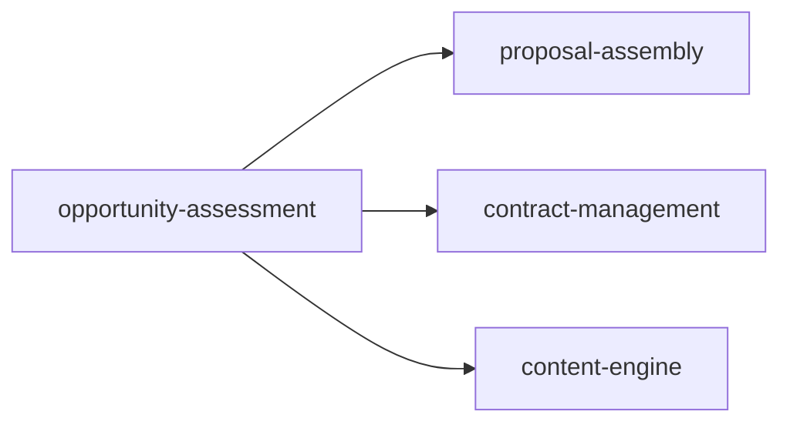

# Opportunity Assessment Skill

## Purpose
Transform discovery meeting transcripts into structured business process maps and opportunity matrices WITHOUT fabricating metrics. This skill enforces strict anti-hallucination rules while identifying automation opportunities.

---

## Activation

This skill activates when ANY of these triggers are detected:

### Primary Commands
- `/lead-management:opportunity-assessment [client-name]`
- `/opportunity-assessment [client-name]`

### Natural Language Triggers
- "Process the discovery call for [client]"
- "Generate opportunity matrix from [transcript]"
- "Create audit from discovery meeting"
- "Assess automation opportunities for [client]"
- "Analyze the discovery transcript"
- "Map processes from the meeting"
- "What opportunities did we identify"

### Contextual Activation
- After `post-call-followup` skill completes
- When Fireflies transcript is available
- When discovery meeting notes are saved

---

## Parameters

```bash
/opportunity-assessment [client-name] [options]

Options:
  --source        transcript|notes|fireflies-url|manual
                  Default: auto-detect

  --output        json|markdown|notion
                  Default: markdown

  --depth         quick|standard|comprehensive
                  Default: standard

  --validate      true|false
                  Default: true (enforce anti-hallucination)
```

---

## Input Sources

### Automatic Detection Priority
1. **Fireflies MCP** - Pull transcript directly
2. **Notion MCP** - Check for meeting notes
3. **Local files** - Check active-projects/[client]/meetings/
4. **Manual input** - Prompt for paste

### Expected Input Format
- Meeting transcript (text or Fireflies format)
- Discovery notes (markdown)
- Combined transcript + summary
- Audio transcription output

---

## 5-Phase Workflow

### Phase 1: Initialize (2 min)
- Load transcript/notes
- Create audit.json structure
- Set metadata (client, date, source)
- Initialize tracking arrays

### Phase 2: Extract Facts (10 min)
- Parse for explicit statements only
- Extract company details
- Identify pain points with quotes
- Mark unknowns for missing data
- NO fabrication of metrics

### Phase 3: Map Processes (15 min)
- Document workflows as described
- Capture steps, tools, people
- Identify bottlenecks
- Quote pain points directly
- Flag missing information

### Phase 4: Identify Opportunities (10 min)
- Link pain points to processes
- Categorize by type and impact
- Score qualitatively (high/medium/low)
- Avoid ROI without baseline data
- Prioritize by impact vs effort

### Phase 5: Generate Outputs (5 min)
- Create audit.json
- Generate opportunity-matrix.md
- Build process-map.md
- List discovery-unknowns.md
- Validate no fabrication

**Total Time**: ~42 minutes

---

## Outputs

### 1. audit.json
Structured data file containing:
- Client brief with validated facts
- Current state process maps
- AI opportunity matrix
- Unknowns and follow-up items
- Metadata and assumptions

### 2. opportunity-matrix.md
Prioritized opportunities organized as:
- **Quick Wins** - High impact, low effort
- **Strategic** - High impact, medium-high effort
- **Later** - Low priority or very high effort

### 3. process-map.md
Visual process documentation:
- Step-by-step workflows
- Bottleneck identification
- Pain point mapping
- System dependencies

### 4. discovery-unknowns.md
Follow-up questions including:
- Critical metrics needed
- Process clarifications
- Stakeholder interviews
- Email templates for client

---

## Anti-Hallucination Rules

### ABSOLUTE REQUIREMENTS
1. **Never fabricate numbers** - No made-up dollars, hours, percentages
2. **Never extrapolate** - "Busy" ≠ "70 hours/week"
3. **Use NULL for unknowns** - Don't guess missing data
4. **Quote directly** - Pain points must be client's exact words
5. **Quality gate** - "Can I point to where client said this?"

### Examples

| ❌ WRONG | ✅ RIGHT |
|----------|----------|
| "Losing $5,500/week" | "Client mentioned losing opportunities" |
| "30% of leads lost" | "Some leads fall through cracks" |
| "ROI: 50x return" | "ROI: TBD - needs baseline metrics" |
| "Takes 30 minutes" | "Process is manual (time unknown)" |

---

## MCP Connector Integration

### With Connectors (Supercharged Mode)

```yaml
fireflies:
  action: pull_transcript
  meeting_id: auto_detect or provided
  output: transcript + summary

notion:
  action: save_outputs
  location: /Clients/[client-name]/Discovery/
  files: [audit.json, opportunity-matrix.md, process-map.md]

slack:
  action: notify_team
  channel: #sales-wins
  message: "Opportunity assessment complete for [client]"
  attachment: opportunity-matrix.md

hubspot:
  action: update_deal
  deal_id: auto_detect
  properties:
    audit_status: complete
    opportunities_identified: count
    next_step: proposal
```

### Without Connectors (Standalone Mode)
- Accept manual transcript input
- Save outputs locally
- Provide copy-paste ready formats
- Generate email templates

---

## Integration Flow

### Upstream Skills


### Downstream Skills


### Data Flow
1. **Input**: Transcript from discovery-prep or post-call-followup
2. **Processing**: 5-phase analysis with validation
3. **Output**: Structured data for proposal-assembly
4. **Archive**: Store in Notion for future reference

---

## Quality Standards

### Successful Assessment
- ✅ All stated facts captured accurately
- ✅ 2-4 processes mapped as described
- ✅ 5-10 opportunities identified
- ✅ Unknowns documented for follow-up
- ✅ NO fabricated metrics
- ✅ Direct quotes for pain points
- ✅ Clear prioritization

### Rejection Criteria
- ❌ Any made-up numbers
- ❌ ROI calculations without data
- ❌ Time estimates not from client
- ❌ Invented process steps
- ❌ Generic pain points

---

## Usage Examples

### Basic Usage
```bash
/opportunity-assessment acme-corp
```
*Searches for ACME Corp transcript and processes with standard depth*

### With Fireflies URL
```bash
/opportunity-assessment acme-corp --source https://fireflies.ai/meeting/abc123
```
*Pulls specific Fireflies transcript*

### Manual Input
```bash
/opportunity-assessment new-client --source manual
```
*Prompts for transcript paste*

### Quick Assessment
```bash
/opportunity-assessment client --depth quick
```
*Fast 20-minute assessment focusing on top opportunities*

### Direct to Notion
```bash
/opportunity-assessment client --output notion
```
*Saves directly to Notion client workspace*

---

## Error Handling

### Common Issues

**"No transcript found"**
- Check Fireflies connection
- Try manual input mode
- Verify client name spelling

**"Insufficient data for assessment"**
- Transcript too short (<500 words)
- No processes described
- Schedule deeper discovery

**"Validation failed"**
- Fabricated metrics detected
- Review and mark as UNKNOWN
- Add to follow-up questions

**"Connector unavailable"**
- Fall back to local mode
- Generate markdown outputs
- Provide manual instructions

---

## Follow-Up Actions

After assessment completes:

1. **Review unknowns** - Schedule follow-up if critical data missing
2. **Validate findings** - Quick client check on process accuracy
3. **Trigger proposal** - Use `/proposal-assembly` with opportunity data
4. **Update CRM** - Mark discovery as complete
5. **Archive outputs** - Store in client folder

---

## Tips for Success

### Getting Quality Input
- Ensure discovery calls are 30+ minutes
- Use structured discovery questions
- Record with Fireflies or similar
- Take notes on specific metrics

### Maximizing Output Value
- Focus on high-frequency processes
- Capture exact pain point quotes
- Document current tools/systems
- Note integration points

### Avoiding Common Pitfalls
- Don't guess missing metrics
- Don't add "obvious" steps
- Don't beautify client language
- Don't calculate fake ROI

---

## Skill Configuration

### Required Files
```
opportunity-assessment/
├── SKILL.md (this file)
├── agents/
│   ├── audit-orchestrator.md
│   └── process-mapper.md
├── templates/
│   ├── audit-schema.json
│   ├── opportunity-matrix-template.md
│   ├── process-map-template.md
│   └── discovery-unknowns-template.md
└── workflows/
    └── assessment-pipeline.md
```

### Environment Variables
```bash
OPPORTUNITY_ASSESSMENT_DEPTH=standard
OPPORTUNITY_ASSESSMENT_VALIDATE=true
OPPORTUNITY_ASSESSMENT_OUTPUT=markdown
```

---

## Command Reference

### Quick Reference Card
```
Primary: /opportunity-assessment [client]
Options: --source --output --depth --validate

Inputs:  Transcript, Notes, Fireflies URL
Outputs: audit.json, opportunity-matrix.md,
         process-map.md, discovery-unknowns.md

Time:    ~42 minutes
Mode:    Standalone or Connector-enhanced
```

---

## Version History

- **v1.0** (2024-02-01) - Initial implementation from AI Agency OS
  - Adapted from comprehensive-ai-audit-agent
  - Simplified from 7 phases to 5
  - Added lead-management integration
  - Enforced anti-hallucination rules

---

## Support

For issues or questions:
- Check discovery-unknowns.md for missing data
- Validate transcript quality (30+ minutes)
- Ensure connectors are configured
- Review anti-hallucination rules

Remember: **When in doubt, mark it UNKNOWN**